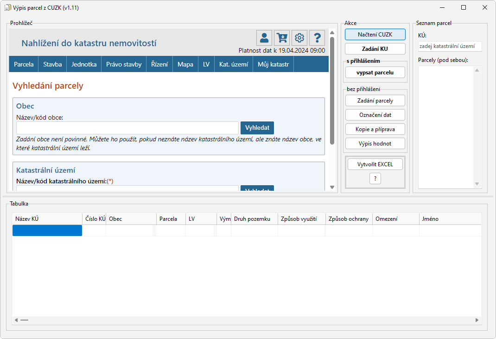

# CUZK-scraper
Jednoduché stahování informací z CUZK, byť lehce manuální.   
Jsou změny v DEV branch. Jakmile se osvědčí, přejde do MAIN.

Stahování informací z CUZK je prakticky identické s vybíráním parcel a informací k nim jako přes webový prohlížeč. Zde jsou dané informace ukládány do tabulky.

WIP - zcela přepracovaný způsob práce s daty - nyní se data sbírají ze zdrojového kódu HTML, takže je práce stabilnější a rychlejší, než bylo s nestabilní systémovou schránkou. Jakmile se změny osvědčí a doladí, přejde na MAIN.

Pro kompilaci je třeba komponent Excel_TLB (součást Office - instalace přes Import Component) a EdgeView2 SDK (přes GetIt).
Více info o EdgeBrowser - https://docwiki.embarcadero.com/RADStudio/Sydney/en/Using_TEdgeBrowser_Component_and_Changes_to_the_TWebBrowser_Component
