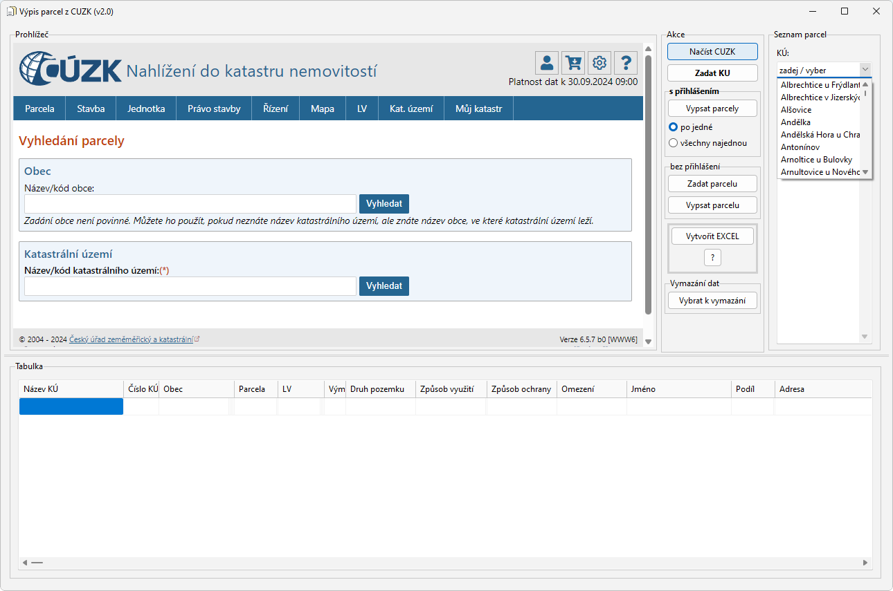

# CUZK-scraper
Jednoduché stahování informací z CUZK.



Stahování informací z CUZK je prakticky identické s vybíráním parcel a informací k nim jako přes webový prohlížeč. Zde jsou dané informace ukládány do tabulky.

Aktuální verze v2 je řešena stažením zdrojového kódu stránky s výpisem parcely. Následně dojde k vypsání údajů o pozemku a uložení do tabulky.   

### Ovládání:
- zadání katastrálního území (uvedeny v textovém souboru KN.txt, případně ruční zadání)
- zadání pozemků k výpisu
- TLAČÍTKO "Načíst CUZK"
Výpis parcel buď podle přihlášení do CUZK nebo pomocí CAPTCHA kódů:

```
S příhlášením - přes ikonku panáčka v HTML
- vybrat jeslti bude proces automatizovaný nebo po jednotlivě po parcelách
- TLAČÍTKO "Vypsat parcely" (buď zvoleno jednou při zvolení vypsat všechny nebo po jedné - co parcela to tlačítko
- TLAČÍTKO "Vytvořit EXCEL" pro výpis do XLSX souboru
```

```
Bez přihlášení
- TLAČÍTKO "Zadat parcelu"
- zadá se CAPTCHA kód do HTML a potvrdí se, následně dojde k zobrazení údajů o parcele
- TLAČÍTKO "Vypsat parcelu" - zvolená parcela se vypíše do tabulky
- opakovat postup
```


### Kompilace ze zdrojového kódu
Pro kompilaci je třeba komponent Excel_TLB (součást Office - instalace přes Import Component) a EdgeView2 SDK (přes GetIt).
Více info o EdgeBrowser - https://docwiki.embarcadero.com/RADStudio/Sydney/en/Using_TEdgeBrowser_Component_and_Changes_to_the_TWebBrowser_Component
